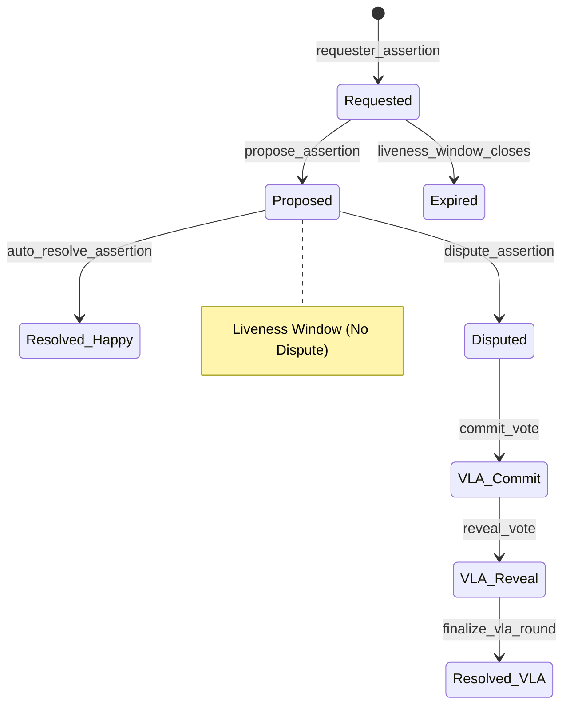

# mORA Protocol Technical Walkthrough

**mORA** (Optimistic Oracle for Solana) is a decentralized protocol for bringing real-world data on-chain using an optimistic model secured by **veMORA** holders.

---

## 1. The Assertion Lifecycle

The lifecycle of a data request (assertion) follows a state-machine driven by economic bonds.

### Phase A: Request
A user (Requester) posts a question and locks two amounts in the assertion escrow:
1.  **Requester Bond ($B_r$)**: Staked to prevent spam.
2.  **Reward ($R$)**: Offered to the successful proposer and arbiters.

### Phase B: Proposal
Any third party can propose an answer by staking a **Proposer Bond ($B_p$)**. 
- **Requirement**: $B_p \geq \text{min\_proposer\_bond}$.
- **States**: The assertion status moves from `Requested` to `Proposed`.

### Phase C: Challenge Window (Optimistic Path)
If the **Liveness Window** passes without a dispute, the assertion can be auto-resolved.
- **Payout**: Proposer receives $B_p + R$.
- **Refund**: Requester receives $B_r$ back.
- **Escrow Closed**: Account is closed to reclaim rent.

---

## 2. VLA (Value Locked Arbitration)

If someone believes a proposal is incorrect, they stake a **Disputer Bond ($B_d$)**. This escalates the assertion to a **VLA Round**.

### Commit-Reveal Voting
Arbiters (veMORA holders) vote to determine the truth.
1.  **Commit Phase**: Arbiters submit a `keccak256(side, salt)`. Their voting power ($vp$) is snapshotted at the round's start time ($t_{start}$).
2.  **Reveal Phase**: Arbiters reveal their `side` (Proposer or Disputer) and `salt`.

### Finalization & Rewards
Once the reveal window closes, the protocol tallies the power:
- $V_{proposer} = \sum vp_i$ (for all $i$ who voted Proposer)
- $V_{disputer} = \sum vp_i$ (for all $j$ who voted Disputer)

**Condition 1: Quorum**
The round is only valid if $V_{proposer} + V_{disputer} \geq Q$ (Quorum).

**Condition 2: The Winner**
- If $V_{proposer} \geq V_{disputer}$, the **Proposer Wins**.
- If $V_{disputer} > V_{proposer}$, the **Disputer Wins**.

---

## 3. The Mathematics of veMORA

The protocol uses a **Slope–Bias** form for voting power, derived from the Curve/veCRV model but optimized for Solana.

### Linear Decay Formula
Voting power $vp(t)$ at time $t$ for an amount $A$ locked until $t_e$ with a maximum duration $T_{max}$:

$$vp(t) = A \cdot \frac{t_e - t}{T_{max}}$$

### Implementation (High Precision)
To maintain accuracy with integer math, mORA uses a **scale factor of $10^{12}$**.

1.  **Slope ($m$)**: The rate of decay per second.
    $$m = \frac{A \cdot 10^{12}}{T_{max}}$$
2.  **Bias ($b$)**: The current voting power.
    $$b(t) = \frac{m \cdot (t_e - t)}{10^{12}}$$

**Example**:
- Lock 10,000 tokens for 2 years ($63,072,000$s).
- $m = \frac{10^{13} \cdot 10^{12}}{63,072,000} \approx 158,549,000,000$.
- After 1 year ($L = 31,536,000$s), $vp = \frac{158,549,000,000 \cdot 31,536,000}{10^{12}} \approx 5,000$ tokens.

---

## 4. Payout & Slashing Mechanics

When a VLA round is finalized, the protocol redistributes the funds in the escrow.

### If Proposer is Correct:
1.  **Proposer Payout**: Proposer receives their bond back plus the Disputer's bond as a reward for defending the truth.
    $$\text{Payout}_p = B_p + B_d$$
2.  **Requester Refund**: $B_r$ is returned to the user.
3.  **Arbiter Reward**: The reward $R$ is distributed pro-rata to all arbiters who voted Proposer.

### Pro-rata Arbiter Reward Formula:
For an arbiter $i$ who voted on the winning side $S$:
$$\text{Reward}_i = R \cdot \frac{vp_i(t_{start})}{\sum_{j \in S} vp_j(t_{start})}$$

---

## 5. Summary Table

| Role | Success Outcome | Failure Outcome |
| :--- | :--- | :--- |
| **Requester** | Gets data answer; $B_r$ refunded. | $B_r$ refunded (neutral). |
| **Proposer** | Receives $B_p + R$ (auto) or $B_p + B_d$ (VLA). | $B_p$ slashed (given to disputer). |
| **Disputer** | Receives $B_d + B_p$ (VLA). | $B_d$ slashed (given to proposer). |
| **Arbiter** | Receives pro-rata share of $R$. | No reward; Possible future slashing. |
