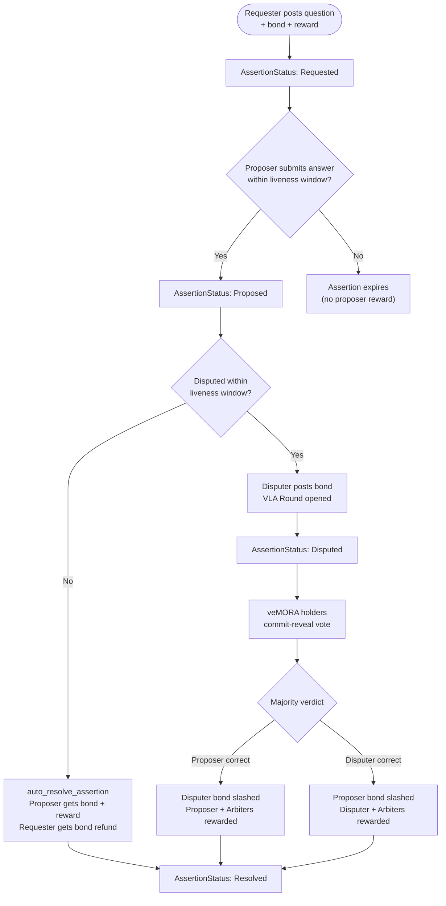
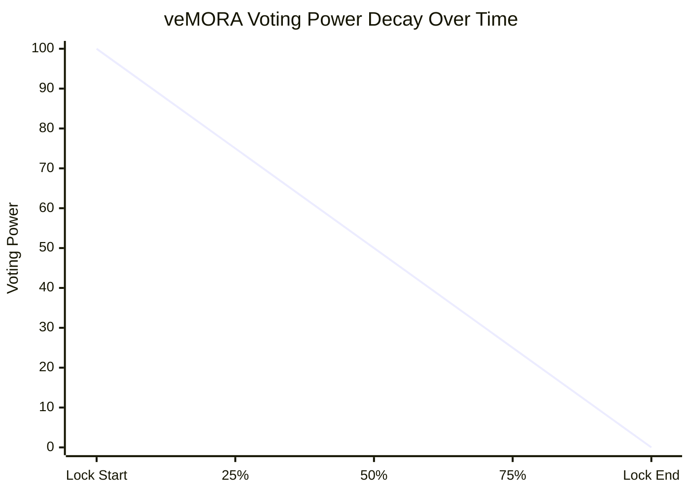
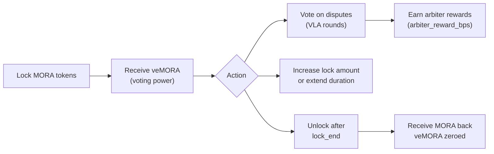

# mORA — Optimistic Oracle for Solana

> **Early Development** — This is a work-in-progress implementation of an optimistic oracle protocol built natively on Solana using the Anchor framework.

---

## What is mORA?

**mORA** is an optimistic oracle protocol for Solana. It allows anyone to request real-world data to be brought on-chain (prices, outcomes, yes/no facts, etc.) using an optimistic model: an answer is accepted by default unless someone disputes it within a challenge window.

Disputes are resolved by **veMORA holders** (value-locked arbiters), who vote to determine the canonical answer. The system is secured by economic bonds — proposers and disputers must stake `MORA` tokens, which are slashed if they act dishonestly.

---

## Architecture

```
oo-core/
├── programs/
│   └── oo-core/
│       └── src/
│           └── lib.rs       # Core Anchor program
├── tests/                   # TypeScript integration tests
├── Anchor.toml
└── Cargo.toml
```

### Core Components

| Component | Description |
|-----------|-------------|
| **Assertion Lifecycle** | Request → Propose → Dispute → Resolve |
| **MORA Token** | Native token used for bonds and rewards |
| **veMORA (Vote-Escrowed MORA)** | MORA locked for voting power over disputes |
| **VLA (Value Locked Arbitration)** | Dispute resolution layer powered by veMORA holders |
| **Global Config** | Admin-controlled protocol parameters |

---

## How It Works



### 1. Request an Assertion
A **requester** posts a question on-chain (e.g., *"Did ETH close above $3000 on Feb 28?"*) along with a bond and reward. Supported answer types: `YesNo`, `Number`, `String`.

### 2. Propose an Answer
Any third party (other than the requester) can propose an answer within the liveness window by staking a `MORA` bond ≥ `min_proposer_bond`.

### 3. Auto-Resolve (Happy Path)
If no one disputes within the liveness window, the assertion auto-resolves. The proposer receives their bond back + the requester's reward. The requester gets their bond refunded.

### 4. Dispute
If someone believes the proposed answer is wrong, they post a dispute bond, escalating the assertion to a **VLA round**.

### 5. VLA Arbitration
veMORA holders vote on the correct answer. The losing side (proposer or disputer) has their bond partially burned/redistributed. Arbiters earn a fee from the protocol (`arbiter_reward_bps`).

---

## veMORA — Voting Escrow

**veMORA** gives long-term MORA holders governance and arbitration rights.

- Lock `MORA` for a configurable duration (min/max set by admin).
- Voting power = `(amount_locked / max_lock_duration) × remaining_time`.
- Longer locks = more voting power.
- Locks can be extended or topped up anytime.





---

## Installation

> Prerequisites: [Rust](https://rustup.rs/), [Solana CLI](https://docs.solana.com/cli/install-solana-cli-tools), [Anchor CLI](https://www.anchor-lang.com/docs/installation), Node.js / Yarn

```bash
# Clone the repo
git clone https://github.com/AbhinavOC24/mOra.git
cd mOra/oo-core

# Install JS dependencies
yarn install

# Build the program
anchor build

# Run tests (localnet)
anchor test
```

---

## Program ID

| Network   | Address |
|-----------|---------|
| Localnet  | `E7TZEgFboKppM4V8yix6UEQrBh2WL2rDqbbn2JYxPnat` |
| Devnet    | TBD |
| Mainnet   | TBD |

---

## Roadmap

### Phase 1 — Core Protocol (Current)
- [x] Global config initialization
- [x] Assertion request with MORA bond + reward escrow
- [x] Optimistic proposal with bond validation
- [x] Liveness window enforcement
- [x] Auto-resolution (happy path)
- [x] Dispute submission
- [x] veMORA locking (create / increase / unlock / refresh)
- [x] Linear voting power model (slope-bias)

### Phase 2 — Arbitration Layer (In Progress)
- [ ] VLA round opening on dispute
- [ ] veMORA commit-reveal voting
- [ ] Vote tallying and canonical answer finalization
- [ ] Bond slashing and arbiter reward distribution
- [ ] VLA commit window enforcement

### Phase 3 — Security & Hardening
- [ ] Full audit of bond accounting
- [ ] Edge case coverage (ties, no quorum, griefing)
- [ ] Fuzz testing with Trident or Ackee
- [ ] Emergency pause / admin controls
- [ ] Upgraded program migration flow

### Phase 4 — Ecosystem & Integrations
- [ ] MORA token deployment (Token-2022)
- [ ] Devnet deployment with public test faucet
- [ ] SDK / client library (TypeScript)
- [ ] Example integrations (DeFi price feeds, prediction markets)
- [ ] Frontend dashboard for requesting and monitoring assertions
- [ ] Mainnet deployment

### Phase 5 — Decentralization
- [ ] DAO governance for protocol parameters
- [ ] Permissionless arbiter registration
- [ ] Multi-currency bond support
- [ ] Cross-program oracle interface standard

---

## Contributing

This project is in early development. Feel free to open issues or PRs. If you're interested in building on top of mORA or want to contribute to the arbitration layer, reach out.

---

## License

MIT
